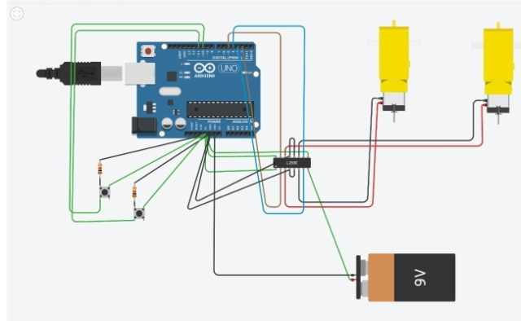

[Επιστροφή στη Κεντρική](../readme.md)

# Μελέτη κίνησης με χρήση Arduino

- Όπως γνωρίζουμε ο μικροελεγκτής Arduino μπορεί να στέλνει απο τις εξόδους της πλακέτας του σήμα αναλογικό ή ψηφιακό (Pulse With Modulation), δηλαδή μπορούν να λειτουργήσουν ώς θετικοί πόλοι μιας μπαταρίας εφόσον αναφερόμαστε στη συμβατική φορά μετακίνησης φορτίου. Επομένως όταν μία έξοδος συνδεθεί με έναν ακροδέκτη ενός μοτέρ (λειτουργίας συνεχούς ρεύματος DC) και ο άλλος ακροδέκτης συνδεθεί με τη γείωση έχουμε περιστροφή του μοτέρ προς μία κατεύθυνση. Για να επιτύχουμε κίνηση προς την αντίθετη κατεύθυνση θα πρέπει να αντιστρέψουμε τη πολικότητα κάτι το οποίο δέ μπορεί να κάνει μέχρι τώρα απο μόνο του το Arduino.

- Το πρόβλημα επιλύεται με την είσοδο της H-Bridge στην οποία μπορούμε να επιλέξουμε εμείς τη πολικότητα που εφαρμόζεται στα άκρα του μοτέρ κάθε χρονική στιγμή και η οποία εξαρτάται από το ζευγάρι καναλιών που ενεργοποιείται: S1/S4 ή S3/S2. Η Θεωρητική υλοποίηση ενός τέτοιου κυκλώματος L293D περιγράφεται στη παρακάτω εικόνα(εδώ θα δουλεύουν σαν HIGH Input λόγο 1-9 pins 5V )

  

- Ακολουθεί η Υλοποίηση ενός τέτοιου κυκλώματος στο TinkerCad με τη χρήση 2 κουμπιών που καθορίζουν τη φορά της κίνησης, για να μπορέσουμε να κατανοήσουμε τόσο τη συνδεσμολογία όσο και το τρόπο προγραμματισμού του Arduino. Παρατίθεται o σύνδεσμος στον οποίο μπορεί να τρέξει κάποιος την εξομοίωση και να δεί τον κώδικα, ακολουθεί μια εικόνα του κυκλώματος για γρήγορη αναφορά.(Χρειάζεται ένας δωρεάν λογαριασμός στο Tinkercad για να τρέξετε το Link).

## 
 [Σύνδεσμος Υλοποίησης σε Tinkercad](https://www.tinkercad.com/embed/g3JbT8yw19p)

  

- Μία τέτοια απλή κατασκευή που τροφοδοτείται απο powerbank, έχει 2 μοτέρ κίνησης που κινούνται ταυτόχρονα προς μία φορά και έναν αισθητήρα απόστασης για να μπορεί σε πιθανή ανίχνευση εμπρόσθιου εμποδίου να αλλάζει κατεύθυνση κινούμενη προς τα πίσω παρουσιάστηκε στο ΔΙΕΚ πάτρας το Δεκέμβρη 2019 (Υλικά&Κατασκευή Πόθος Ιωάννης).

## 
 [Βίντεο παρουσίασης πρώτης πλατφόρμας κίνησης](https://www.facebook.com/watch/?v=739530876530282) 

  

- Το επόμενο βήμα ήταν η συναρμολόγηση πλατφόρμας η οποία εκτός απο τα Βασικά (μπρός και πίσω) θα μπορούσε να ελέγξει για εμπόδια αριστερά και δεξιά και θα αποφάσιζε προς τα που θα κινηθεί. Επομένως ενεργοποιώντας μόνο το ένα μοτέρ θα περιστρεφόταν προς την αντίθετη κατεύθυνση θα έπαιρνε τη μέτρηση και μετά με ενεργοποίηση του άλλου πηγαίνει στην αντίθετη κατεύθυνση για επόμενη μέτρηση και τέλος επαναφορά στην αρχική θέση.
Η πλατφόρμα αυτή παρουσιάστηκε στη Χριστουγεννιάτικη εκδήλωση του ΔΙΕΚ Πάτρας(Σύνδεσμος στη πρώτη σελίδα και Ειδικότερα η λειτουργία της φαίνεται στο παρακάτω βίντεο)

## 
 [Βίντεο: Αποφυγή εμποδίων απο Arduino Car v2 ](https://www.youtube.com/watch?v=sYD2LIY47uA) 

  
<a href="CarV2.txt"><b>
Πατήστε για εμφάνιση του κώδικα της Έκδοσης 2.0
</b></a> 

- Στη συνέχεια παρουσιάζεται η συνδεσμολογία που χρησιμοποιήθηκε με L293D, τονίζοντας πως<u> αναπτύσσονται σχετικά εύκολα υψηλές θερμοκρασίες ακόμα και με τη παρουσία Headers οπότε θα ακολουθήσει κατασκευή σε L298N που ενώ έχει μικρή πτώση τάσης ~2V διαθέτει καλύτερο σύστημα ψύξης</u> και δυνατότητα παροχής τροφοδοσίας 5V στο υπόλοιπο κύκλωμα εφόσον η τάση που το τροφοδοτούμε δέ ξεπεράσει τα 12V.

  

Η συνδεσμολογία ενός τέτοιου συστήματος L298N παρουσιάζεται παρακάτω.

  

- Σε ένα τέτοιο σύστημα τα καλώδια που θα χρειαστεί να συνδέσουμε είναι σαφώς λιγότερα  "κουμπώνουν" με βίδες πάνω στη πλακέτα οπότε δέν έχουμε εύκολα αποκολλήσεις και πλέον μπορούμε να χρησιμοποιήσουμε ακόμα πιο ισχυρές επαναφορτιζόμενες μπαταρίες (τις 18650 των 3,6V). 
 - Ένα επιπλέον προτέρημα είναι ότι πλέον έχουμε αρκετή ισχύ να τοποθετήσουμε 4 DC motors κάνοντας το όχημα 4WD δίνοντάς του μεγάλη αυτονομία και ελευθερία στη κίνηση.

  
 

- Πιο δυνατές μπαταρίες σημαίνει περισσότερο ωφέλιμο φορτίο οπότε αναβαθμίστηκε η κατασκευή πηγαίνοντας σε όχημα με επιπλέον όροφο το οποίο μας επιτρέπει και καλύτερη διαχείρηση χώρου.

  

## Τέλος έχουμε την έκδοση v3.0 όπου είναι και αυτή που θα παρουσιάσουμε στο διαγωνισμό η οποία μας αφήνει αρκετό χώρο να τοποθετήσουμε το βραχίονα, η οθόνη αναβαθμίστηκε απο 2Χ16 σε 4Χ16, οι μπαταρίες απο AA(1.2V) σε 18650(3.6V),τα μοτέρ κίνησης αυξήθηκαν απο 2 σε 4 και έχουμε έναν επιπλέον όροφο χωρίς να θυσιάζουμε την ισορροπία καθώς διατηρήσαμε το κέντρο βάρους χαμηλά.

  

### Επόμενο βήμα είναι να αναβαθμιστεί ο κώδικας ώστε να έχουμε Line - Follower κάτω απο τον αισθητήρα Υπερήχων και η κατασκευή μας να σταματάει σε συγκεκριμένα σημεία για μετρήσεις.

